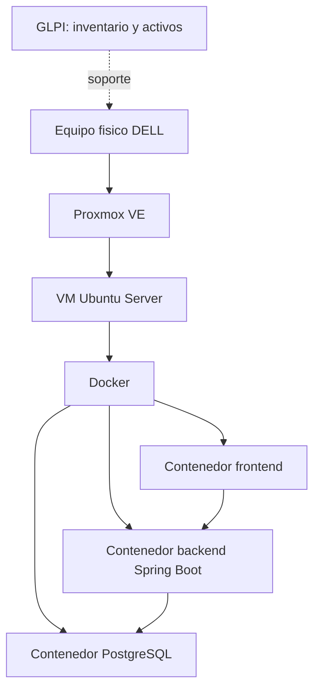
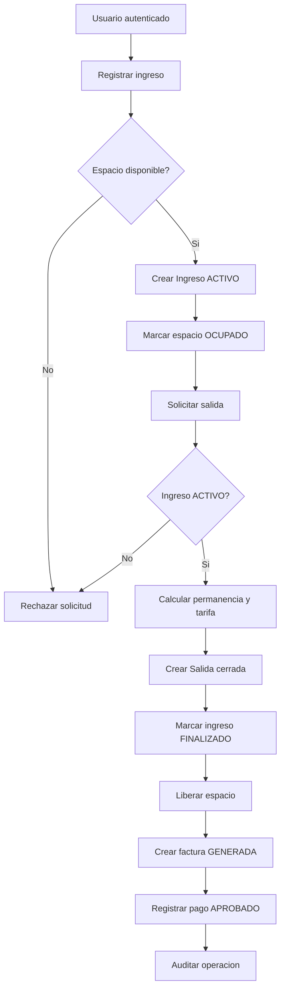
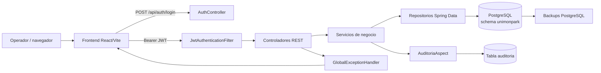

# Bitacora tecnica de UnimonPark

**Fecha de corte:** 2026-09-04  
**Proyecto:** UnimonPark  
**Alcance:** backend Spring Boot, frontend React/Vite, persistencia PostgreSQL y trazabilidad de operaciones.

> Esta bitacora se construyo a partir del estado del codigo disponible en la fecha de corte. El workspace no contiene un directorio `.git` visible, por lo que no se asignan fechas historicas de commits que no puedan verificarse. Las fechas de las fases sin evidencia historica se marcan como **por confirmar**.

## 1. Resumen ejecutivo

UnimonPark gestiona el ciclo de parqueadero desde el registro de usuarios, vehiculos y espacios hasta el ingreso, salida, facturacion y pago. El backend expone una API REST protegida con JWT y roles; el frontend contiene autenticacion, rutas protegidas y un modulo funcional de roles.

La solucion tiene una base funcional clara, pero requiere fortalecer la consistencia transaccional, la seguridad de configuracion y la trazabilidad de cambios antes de considerarse lista para produccion.

## 2. Cronologia de trabajo

| Fecha | Fase o evento | Evidencia | Resultado | Estado |
|---|---|---|---|---|
| 16/04/2026 - 30/04/2026 | Levantamiento inicial de requisitos y estudio del entorno | Informe 01; actividades de requisitos, infraestructura y analisis | Se revisaron equipos, contexto institucional, requisitos, estructura y mantenimiento de software | Implementado |
| 01/05/2026 - 15/05/2026 | Analisis de arquitectura y continuidad operativa | Informe 02; validacion de datos, usuarios corporativos y contingencia | Se identificaron necesidades de continuidad y se documento una afectacion electrica general | Implementado con incidente |
| 16/05/2026 - 31/05/2026 | Recuperacion de servicios y formulacion del proyecto | Informe 03; bitacora de contingencia, UNIDOCS, GLPI y dashboard | Se restauraron servicios, servidores y plataformas; se definio el alcance preliminar del proyecto | Implementado |
| 01/06/2026 - 15/06/2026 | Preparacion de infraestructura y levantamiento con usuarios | Informe 04; Proxmox VE, Ubuntu Server, Docker y encuesta | Se preparo la virtualizacion y el entorno contenerizado para frontend, backend y PostgreSQL; se levantaron necesidades mediante entrevistas y encuestas | Implementado |
| 16/06/2026 - 30/06/2026 | Modelo de datos y mantenimiento de infraestructura | Informe 05; propuesta tecnica, mantenimiento preventivo/correctivo y GLPI | Se estructuro la base de datos y se realizaron diagnosticos, limpieza, inventario y optimizacion de equipos | Implementado |
| 01/07/2026 - 15/07/2026 | Despliegue inicial y modulo de roles | Informe 06; contenedores en VM Ubuntu sobre Proxmox, Spring Boot, DBeaver y modulo `Rol` | Se habilito la comunicacion frontend-backend-servidor, se verificaron relaciones de base de datos y se inicio la implementacion por capas | Implementado |
| 15/07/2026 - 31/07/2026 | Construccion de modulos maestros y manejo de errores | Informe 07; `Usuario`, `TipoVehiculo`, `Vehiculo`, `EspacioParqueo`, enums y excepciones | Se agregaron Lombok, excepciones personalizadas, `GlobalExceptionHandler` y los catalogos principales | Implementado |
| 01/08/2026 - 15/08/2026 | Construccion del ciclo operativo y documentacion | Informe 08; `Ingreso`, `Salida`, `Pago`, `Factura` y anexos tecnicos | Se implementaron ocupacion/liberacion de espacios, calculo de permanencia, tarifas, pagos y facturacion | Implementado |
| Por confirmar | Exposicion de API REST | Controladores bajo `/api` | Se habilitaron operaciones CRUD y operaciones del ciclo de parqueadero | Implementado |
| Por confirmar | Incorporacion de seguridad | `SecurityConfig`, filtro JWT y `UsuarioDetailsService` | Se establecio autenticacion stateless y autorizacion por rol | Implementado |
| Por confirmar | Incorporacion de auditoria | `Auditable` y `AuditoriaAspect` | Se intento registrar altas, cambios y eliminaciones | Implementado con observaciones |
| Por confirmar | Construccion del frontend inicial | React/Vite, `AuthContext`, `ProtectedRoute`, `RolesPage` | Login y administracion de roles disponibles | Parcial |
| 2026-09-04 | Diagnostico tecnico y documentacion | Inspeccion del codigo y configuracion | Se consolidan riesgos, relaciones, flujos y trazabilidad | En curso |

### Evidencia documental incorporada

La cronologia anterior se complemento con los informes `GFPI-F-147BitacoraSeguimientoEtapaProductiva01.xlsx` a `GFPI-F-147BitacoraSeguimientoEtapaProductiva08.xlsx`. El informe 03 tiene un espacio antes de `.xlsx` en su nombre original; se conserva esa referencia para facilitar su localizacion. Los anexos tecnicos y el resumen ejecutivo mencionados en el informe 08 no fueron incluidos en los archivos recibidos, por lo que se registran como evidencia referenciada, no como documentos revisados.

## 3. Componentes de la solucion

| Capa | Componentes | Responsabilidad |
|---|---|---|
| Presentacion | React, TypeScript, Vite, React Router, componentes UI | Login, rutas protegidas, layout y roles |
| API | Controladores Spring MVC | Recibir solicitudes, validar acceso y devolver DTOs |
| Aplicacion | Interfaces `service` e implementaciones `service.impl` | Reglas de negocio y coordinacion de persistencia |
| Persistencia | Repositorios Spring Data JPA | Consultas y operaciones sobre PostgreSQL |
| Dominio | Entidades, enums y DTOs | Modelo de parqueadero y contratos de entrada/salida |
| Seguridad | JWT, BCrypt, filtro de autenticacion, roles | Identidad, sesiones stateless y permisos |
| Trazabilidad | Aspecto de auditoria y entidad `Auditoria` | Registrar operacion, usuario, IP y datos nuevos |
| Base de datos | PostgreSQL, esquema `unimonpark` | Almacenar informacion operativa y de auditoria |

### Evolucion de infraestructura registrada en los informes

1. **Preparacion fisica:** se organizo y configuro el puesto de trabajo y los equipos requeridos.
2. **Virtualizacion:** se asigno un equipo DELL y se instalo Proxmox VE para administrar una maquina virtual de soporte.
3. **Sistema base:** se instalo Ubuntu Server y se preparo el entorno Linux.
4. **Contenerizacion:** se implementaron contenedores Docker para frontend, backend y PostgreSQL, buscando portabilidad y escalabilidad.
5. **Despliegue:** la aplicacion se publico en una VM Ubuntu sobre Proxmox y se verifico la comunicacion desde frontend, backend y cliente de base de datos.
6. **Operacion y soporte:** se uso GLPI para inventario y ciclo de vida de activos, junto con mantenimiento preventivo y correctivo de equipos.

### Versiones y configuracion identificadas

- Java 21.
- Spring Boot 3.5.16.
- Spring Data JPA, Validation, Web, Security y AOP.
- PostgreSQL como motor de datos.
- JJWT 0.12.6.
- Lombok 1.18.36.
- React/TypeScript/Vite en el frontend.
- El backend usa `ddl-auto=update` y tiene logs SQL detallados activados; esto debe revisarse para produccion.

## 4. Inventario de entidades

Todas las entidades usan identificadores `Long` autogenerados con estrategia `IDENTITY`, salvo que se indique lo contrario. Las relaciones se declaran principalmente desde la entidad dependiente.

### 4.1 Seguridad y administracion

| Entidad / tabla | Componentes principales | Relaciones |
|---|---|---|
| `Rol` / `roles` | `idRol`, `nombre`, `descripcion`, `activo` | Es referenciado por `Usuario` |
| `Usuario` / `usuarios` | `idUsuario`, `nombres`, `apellidos`, `documento`, `correo`, `telefono`, `nombreUsuario`, `contrasenaHash`, `activo`, `fechaCreacion`, `fechaActualizacion` | `ManyToOne` a `Rol` mediante `id_rol` |
| `Auditoria` / `auditoria` | `idLog`, `tablaAfectada`, `tipoOperacion`, `registroId`, `datosAnteriores`, `datosNuevos`, `fecha`, `ipOrigen` | `ManyToOne` a `Usuario` mediante `id_usuario`; usa JSONB para snapshots |

### 4.2 Catalogos y recursos del parqueadero

| Entidad / tabla | Componentes principales | Relaciones |
|---|---|---|
| `TipoVehiculo` / `tipos_vehiculo` | `idTipoVehiculo`, `nombre`, `descripcion`, `activo` | Referenciado por vehiculos, espacios y tarifas |
| `Vehiculo` / `vehiculos` | `idVehiculo`, `placa`, `marca`, `modelo`, `color`, `activo`, `fechaCreacion` | `ManyToOne` a `Usuario` por `id_usuario`; `ManyToOne` a `TipoVehiculo` por `id_tipo_vehiculo` |
| `EspacioParqueo` / `espacios_parqueo` | `idEspacio`, `codigo`, `piso`, `zona`, `estado`, `activo` | `ManyToOne` a `TipoVehiculo` por `id_tipo_vehiculo` |
| `Tarifa` / `tarifas` | `idTarifa`, `nombre`, `valorHora`, `activo`, `fechaCreacion` | `ManyToOne` a `TipoVehiculo` por `id_tipo_vehiculo` |

### 4.3 Operacion, facturacion y recaudo

| Entidad / tabla | Componentes principales | Relaciones |
|---|---|---|
| `Ingreso` / `ingresos` | `idIngreso`, `fechaIngreso`, `lecturaInicialKm`, `tipoIngreso`, `estado` | `ManyToOne` a `Vehiculo` por `id_vehiculo`; `ManyToOne` a `EspacioParqueo` por `id_espacio_parqueo` |
| `Salida` / `salidas` | `idSalida`, `fechaSalida`, `lecturaFinalKm`, `tiempoPermanencia`, `valorTotal`, `observaciones`, `estado` | `OneToOne` a `Ingreso` por `id_ingreso`; `ManyToOne` a `Tarifa` por `id_tarifa` |
| `Factura` / `facturas` | `idFactura`, `fecha`, `subtotal`, `descuento`, `iva`, `total`, `estado` | `OneToOne` a `Salida` por `id_salida`; `ManyToOne` a `Usuario` por `id_usuario` |
| `Pago` / `pagos` | `idPago`, `fecha`, `monto`, `metodoPago`, `referencia`, `estado` | `OneToOne` a `Factura` por `id_factura`; la columna no declara explicitamente `unique=true` |

**Nota:** los nombres exactos de columnas deben confirmarse contra el esquema desplegado. Los dumps presentes son respaldos PostgreSQL en formato custom y no permiten validar sus restricciones leyendo el archivo como SQL plano.

## 5. API y permisos

| Recurso | Ruta base | Lectura | Escritura |
|---|---|---|---|
| Autenticacion | `/api/auth` | Publica para login | `POST /login` publico |
| Usuarios | `/api/usuarios` | Usuario autenticado | Solo `ADMINISTRADOR` |
| Roles | `/api/roles` | Usuario autenticado | Solo `ADMINISTRADOR` |
| Tipos de vehiculo | `/api/tipos-vehiculo` | Usuario autenticado | Solo `ADMINISTRADOR` |
| Vehiculos | `/api/vehiculos` | Usuario autenticado | Crear: `ADMINISTRADOR` o `GESTION`; actualizar/eliminar: `ADMINISTRADOR` |
| Espacios | `/api/espacios_parqueo` | Usuario autenticado | Solo `ADMINISTRADOR` |
| Tarifas | `/api/tarifas` | Usuario autenticado | Solo `ADMINISTRADOR` |
| Ingresos | `/api/ingresos` | Usuario autenticado | Crear: `ADMINISTRADOR`, `GESTION` o `SUPERVISOR` |
| Salidas | `/api/salidas` | Usuario autenticado | Crear: `ADMINISTRADOR` o `GESTION` |
| Facturas | `/api/facturas` | Usuario autenticado | Crear: `ADMINISTRADOR` o `GESTION` |
| Pagos | `/api/pagos` | Usuario autenticado | Crear: `ADMINISTRADOR` o `GESTION` |

Las rutas no publicas requieren autenticacion por la regla global `anyRequest().authenticated()`. La autorizacion fina usa `@PreAuthorize`.

## 6. Procedimientos de negocio

### 6.1 Ingreso de vehiculo

1. Se localizan el vehiculo y el espacio.
2. Se valida que el espacio este `DISPONIBLE`.
3. Se crea el ingreso con la hora actual y estado `ACTIVO`.
4. Se guarda el ingreso.
5. Se actualiza el espacio a `OCUPADO`.

El estado recibido en el DTO no controla el resultado: el servicio fuerza `ACTIVO`.

### 6.2 Salida de vehiculo

1. Se localiza el ingreso y se exige estado `ACTIVO`.
2. Se localiza la tarifa.
3. Se calcula la permanencia desde la entrada hasta la hora actual.
4. Se redondean los minutos hacia arriba a horas cobrables, con minimo de una hora.
5. Se calcula `valorTotal = valorHora * horasCobradas`.
6. Se crea la salida con estado textual `cerrado`.
7. Se marca el ingreso como `FINALIZADO`.
8. Se libera el espacio con estado `DISPONIBLE`.

### 6.3 Facturacion y pago

1. La factura toma `salida.valorTotal` como subtotal.
2. Los valores nulos de descuento e IVA se convierten en cero.
3. Se rechaza un descuento mayor al subtotal.
4. Se calcula `total = subtotal - descuento + iva` y se marca `GENERADA`.
5. El pago toma el total de la factura, fuerza estado `APROBADO` y almacena metodo y referencia.

No se observa cambio de estado de factura posterior al pago ni validacion de duplicidad.

### Diagrama de procedimiento

## 7. Trazabilidad de infraestructura

### Matriz de trazabilidad

| Evento | Entrada | Componente que decide | Persistencia | Evidencia o salida |
|---|---|---|---|---|
| Login | Usuario y contrasena | `AuthController` / servicio de usuario | `usuarios` | JWT, usuario y rol |
| Alta de ingreso | IDs de vehiculo y espacio | `IngresoServiceImpl` | `ingresos`, `espacios_parqueo` | Ingreso activo y espacio ocupado |
| Alta de salida | ID de ingreso y tarifa | `SalidaServiceImpl` | `salidas`, `ingresos`, `espacios_parqueo` | Valor total, ingreso finalizado y espacio libre |
| Generacion de factura | ID de salida, usuario, descuentos | `FacturaServiceImpl` | `facturas` | Factura generada |
| Registro de pago | ID de factura, metodo, referencia | `PagoServiceImpl` | `pagos` | Pago aprobado |
| Auditoria | Resultado de operacion y contexto de seguridad | `AuditoriaAspect` | `auditoria` | Usuario, IP, tabla, operacion y datos nuevos |

## 8. Inconvenientes identificados y tratamiento

La siguiente tabla registra problemas observables en el estado actual. “Resuelto” solo se usa cuando existe una solucion implementada en el codigo; los demas son acciones recomendadas, no cambios ya realizados.

| Prioridad | Inconveniente | Impacto | Tratamiento actual | Estado |
|---|---|---|---|---|
| Alta | Credenciales de base de datos y secreto JWT en `application.properties` | Exposicion de secretos y dificultad para rotarlos | Deben moverse a variables de entorno o gestor de secretos y rotarse | Pendiente |
| Alta | Interrupcion del servicio electrico durante la madrugada del 15/05/2026 | Afectacion total de las sedes y riesgo para servidores, bases de datos y continuidad del software | Se redacto una bitacora de contingencia, se definio la restauracion segura y el 22/05/2026 se verifico el inicio de servicios, servidores y plataformas | Recuperado; fortalecer prevencion |
| Alta | Evidencias de conexion contenian usuario, contrasena y puertos | Riesgo de divulgacion de informacion de infraestructura | Se omitieron esas evidencias del analisis publico; se recomienda rotar secretos, usar variables de entorno y aplicar politica de evidencias sin credenciales | Mitigacion pendiente |
| Alta | Ingreso y salida actualizan varias entidades sin transaccion explicita | Estado parcial si falla una escritura intermedia | Agregar `@Transactional` y pruebas de rollback | Pendiente |
| Alta | Verificacion de espacio disponible sin bloqueo | Dos ingresos concurrentes pueden ocupar el mismo espacio | Usar bloqueo pesimista/optimista y restriccion de negocio | Pendiente |
| Alta | Auditoria de eliminaciones puede quedar sin `registroId` | Se pierde trazabilidad y el guardado puede fallar | Devolver el ID o capturarlo desde argumentos; registrar el error con logger | Pendiente |
| Media | `datosAnteriores` no se llena en actualizaciones | No hay comparacion completa del cambio | Capturar estado anterior antes de ejecutar la operacion | Pendiente |
| Media | Pago siempre queda `APROBADO` y no actualiza factura | Puede haber pagos repetidos o estados inconsistentes | Validar factura generada, unicidad y transicion de estado | Pendiente |
| Media | Factura no valida salida facturable ni duplicidad | Puede facturarse una salida invalida o dos veces | Validar estado, existencia previa y correspondencia del usuario | Pendiente |
| Media | `Pago` declara `OneToOne` sin restriccion unica explicita | La base puede aceptar mas de un pago por factura | Agregar restriccion unica y migracion controlada | Pendiente |
| Media | El estado enviado para ingreso se ignora | Contrato DTO y comportamiento real divergen | El servicio fuerza `ACTIVO`; simplificar DTO o validar el valor recibido | Detectado |
| Media | `EspacioParqueoResponseDTO.idTipoVehiculo` es `String` y recibe el nombre | El contrato mezcla ID y descripcion | Separar tipos y campos semanticos | Pendiente |
| Media | Nombres de tablas auditadas no siempre coinciden con tablas JPA | Consultas y reportes de auditoria pueden ser ambiguos | Centralizar nombres de tabla o derivarlos de metadata JPA | Pendiente |
| Media | Rol actualizado puede auditarse como `CREAR` | Historial incorrecto | Diferenciar crear y actualizar en el servicio/aspecto | Pendiente |
| Media | Borrado fisico de datos con referencias historicas | Se puede perder contexto operativo | Preferir baja logica usando `activo` y politicas de retencion | Pendiente |
| Media | `ddl-auto=update`, SQL visible y parametros en TRACE | Riesgo de cambios automaticos y filtracion de datos | Usar migraciones versionadas y niveles de log de produccion | Pendiente |
| Baja | Cobertura de pruebas limitada a carga de contexto | Regresiones de reglas de negocio no detectadas | Agregar pruebas unitarias, integracion y seguridad | Pendiente |
| Alta | El build del frontend falla en `RolesPage.tsx` por llaves/sintaxis TypeScript | Impide generar el bundle de produccion | Corregir el bloque de `handleEliminar` y volver a ejecutar `npm run build` | Pendiente |
| Baja | Dashboard frontend aun en construccion | Operacion incompleta para usuarios finales | Construir vistas operativas y conectar endpoints restantes | En curso |

## 9. Pruebas y criterios de aceptacion recomendados

- Login correcto, credenciales invalidas, usuario inactivo y expiracion de JWT.
- Permisos por cada rol en lectura y escritura.
- No permitir ingreso en espacio ocupado.
- No permitir dos ingresos concurrentes para el mismo espacio.
- Calculo de una hora minima y redondeo de permanencia.
- No permitir salida de ingreso finalizado.
- Rollback si falla la actualizacion del ingreso o del espacio.
- No permitir factura duplicada para una salida.
- No permitir pago duplicado y validar el estado de factura.
- Auditoria con `registroId`, usuario, IP, operacion, estado anterior y nuevo.
- Verificar que ningun secreto aparezca en repositorio, logs o respuestas HTTP.
- Prueba de construccion del backend con Maven y del frontend con Vite.

## 10. Plan de continuidad de la bitacora

Para cada nuevo trabajo registrar:

1. Fecha y responsable.
2. Modulo o entidad afectada.
3. Problema reproducible.
4. Causa raiz.
5. Solucion aplicada y archivos modificados.
6. Prueba ejecutada y resultado.
7. Riesgos o pendientes derivados.

La proxima actualizacion deberia comenzar por externalizar secretos, agregar transacciones al ciclo ingreso/salida y crear pruebas de autorizacion y concurrencia. Luego conviene completar la auditoria de estados anteriores y conectar los modulos pendientes del frontend.

## 11. Fuentes tecnicas revisadas

- `src/main/java/co/edu/unimonserrate/unimonpark/entity/`
- `src/main/java/co/edu/unimonserrate/unimonpark/controller/`
- `src/main/java/co/edu/unimonserrate/unimonpark/service/`
- `src/main/java/co/edu/unimonserrate/unimonpark/security/`
- `src/main/java/co/edu/unimonserrate/unimonpark/aspect/`
- `src/main/resources/application.properties`
- `pom.xml`
- `unimonpark-frontend/src/`
- `bk_bd_unimonpark/`
- Informes externos `GFPI-F-147BitacoraSeguimientoEtapaProductiva01.xlsx` a `GFPI-F-147BitacoraSeguimientoEtapaProductiva08.xlsx` ubicados en `Downloads/FIRMADOS/`.

El archivo `GFPI-F-147BitacoraSeguimientoEtapaProductiva09 .xlsx` tambien fue detectado en la carpeta, pero no se incorporo porque no hizo parte de los ocho informes solicitados.
